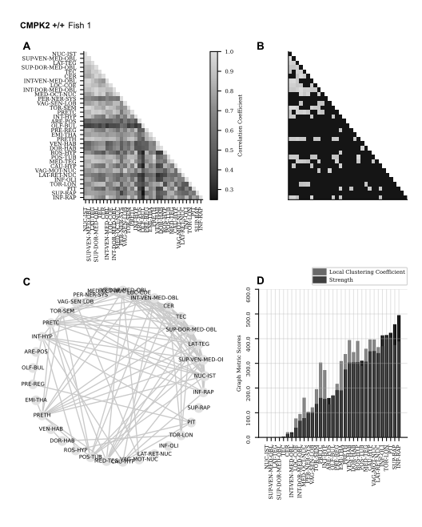

# Graph Theory 

### Neighborhood
$$N_{i} = { v_{j}: e_{ij} \in E \thinspace \textbf{or} \ e_{ji} \in E }$$

Where: $N_i$ is the neighborhood of vertex $i$. $v_i$, $e_{ij}, e_{ji}$ represents the edge between two vertices $i$ and $j$. $v_{j}$ is the vertex connected to vertex i $v_{i}$; And so, we define $k_i$ as $\lvert{N_i}\rvert$, the number of vertices in $N_{i}$, the neighborhood of vertex $v_{i}$

### Strength

$$s_i = \sum_{j=1}^{N}a_{ij}w_{ij}$$

Where: $s_i$ is the strength of a specific vertex $i$. $a_{ij}$ establishes if an edge exists between vertex $i$ and vertex $j$. $w_{ij}$ is the weight between vertex $i$ and vertex $j$.

### Clustering Coefficient 

If a vertex $v_i$ has $k_i$ neighbors, $\frac{k_i(k_i-1)}{2}$ edges could exist among vertices in its neighborhood. Thus, the local clustering coefficient for undirected graphs can be defined as:
$$C_{i_{\textrm{weighted}}} = \frac{2\lvert{s_{jk} : v_j, v_k \in N_i, e_{jk} \in E } \rvert}{k_i(k_i - 1)}$$

 
