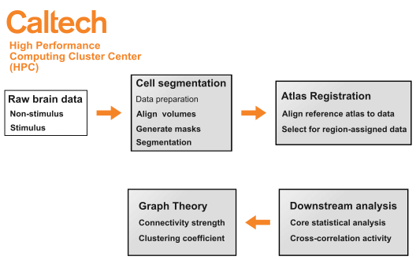

# ZeAnT
ZeAnT stands for zebrafish-specific analysis tools, a computational platform that hosts cell-segmentation and brain atlas registration software for high-throughput and large-scale analysis of whole-brain calcium imaging data in zebrafish. This is the accompanying body of work for my Master of Science degree in Computation and Neural Systems at Caltech. Please send any questions you may have to my email desia.thescientist@gmail.com

  
